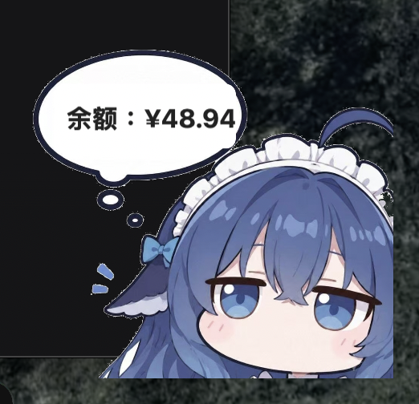

# DeepSeek 余额桌宠 · macOS 原生版

[English](README.md) | **中文**

一只挂在 macOS 桌面上的 DeepSeek 娘：**无边框、背景全透明、始终置顶**，气泡里显示你 DeepSeek 账号的实时余额，默认每 20 秒刷新一次。

这是 [Ho11ow8/deepseek-harness-balance-pet](https://github.com/Ho11ow8/deepseek-harness-balance-pet)（Windows 专用，WPF + `DesktopPet.exe`）的 macOS 原生重写：沿用同一张人物立绘和同一套气泡几何，但不再需要 Windows、.NET 或任何浏览器。



## 特点

- **浮在所有窗口之上**：`NSWindow.level = .floating` + `collectionBehavior = [.canJoinAllSpaces, .fullScreenAuxiliary]`，切到任何 App、任何桌面空间、全屏应用上都看得见
- **不抢焦点**：窗口 `canBecomeKey` 恒为 `false`，输入焦点永远在原来的 App 上
- **不占 Dock、不占菜单栏**：`LSUIElement = 1`
- **零依赖**：只用 Xcode Command Line Tools 里的 `swiftc` 编译，没有 Xcode 工程、没有第三方库
- **不依赖浏览器**：自己读 `~/.dsh/.credentials.yaml` 后直连 `https://api.deepseek.com/user/balance`，关掉浏览器和 Harness 也照常显示
- 拖动、单击刷新、悬停隐藏、右键菜单、位置记忆、多显示器夹取

## 环境要求

- macOS 13 或更高
- Xcode Command Line Tools：`xcode-select --install`（只装了 CLT 即可，不需要完整 Xcode）

## 构建

```sh
./build.sh                  # 编译 + 组装 .app + 跑一次无窗口自检
./build.sh --run            # 顺便启动
./build.sh --install        # 顺便安装到 ~/Applications
```

产物：`build/DeepSeekBalancePet.app`

开机自启：把 `~/Applications/DeepSeekBalancePet.app` 拖进「系统设置 → 通用 → 登录项」。

## 使用

| 操作 | 效果 |
| --- | --- |
| 左键拖动 | 移动到任意位置；位置记在 `UserDefaults`，重开仍在，窗口变小会自动夹回可视区 |
| 单击 / 双击 | 立即刷新余额 |
| 悬停 | 右上角出现 `×`，点一下隐藏 |
| 右键 | 菜单：立即刷新 / 隐藏挂件 / 打开配置文件 / 退出 |
| 隐藏后 | 原地留一个圆形 `¥` 小片，点它恢复，右键可退出 |

退出：右键 → 退出，或 `pkill -f DeepSeekBalancePet`。

## 配置

首次运行会在 `~/Library/Application Support/DeepSeekBalancePet/config.json` 生成一份默认配置，改哪项覆盖哪项：

```json
{
  "pollSeconds": 20,
  "width": 220,
  "currency": "CNY",
  "shadow": true,
  "animation": true,
  "margin": 16,
  "apiBase": "https://api.deepseek.com"
}
```

| 字段 | 默认值 | 说明 |
| --- | --- | --- |
| `pollSeconds` | `20` | 刷新间隔（秒），最小 5 |
| `width` | `220` | **人物本身**的宽度（pt），高度按 960×912 自动算；投影留白额外算在外面 |
| `currency` | `CNY` | 优先币种；填 `auto` 表示取第一个非零币种 |
| `shadow` | `true` | 投影，对齐原版 WPF 的 `DropShadowEffect(Blur 14 / Depth 3 / Opacity 0.38)` |
| `animation` | `true` | 轻微上下浮动（Core Animation，GPU 驱动，不占 CPU） |
| `margin` | `16` | 默认贴边距离（右下角） |
| `apiBase` | `https://api.deepseek.com` | 余额接口地址，可指向镜像/网关 |

右键菜单里的「打开配置文件」会直接打开它。`pollSeconds` 下次轮询即生效；几何相关项重启 App 生效。

### 关于币种

多币种账号的 `balance_infos` 是数组，原文取第 0 条。实测这个账号返回 `[USD:0.00, CNY:48.94]`，照抄会显示「余额：$0.00」。这里的取值顺序是：**指定币种 → 第一个非零币种 → 第一条**，所以正确显示「余额：¥48.94」。

## API Key

按以下顺序查找：

1. 环境变量 `DEEPSEEK_API_KEY`
2. `~/.dsh/.credentials.yaml` 里的 `DEEPSEEK_API_KEY` 行

也就是说，**只要你把 key 放进环境变量，这个 App 就和 DeepSeek Harness 完全无关了**。key 只在本进程内使用，只发给 `apiBase` 指向的地址。

## 自检与日志

```sh
# 不开窗口，检查配置 / 凭证 / 立绘 / 余额接口四项后退出
build/DeepSeekBalancePet.app/Contents/MacOS/DeepSeekBalancePet --selftest

# 打印配置、日志、凭证文件的位置
build/DeepSeekBalancePet.app/Contents/MacOS/DeepSeekBalancePet --print-paths
```

`./build.sh` 每次构建后都会自动跑一遍 `--selftest`。

日志：`~/Library/Application Support/DeepSeekBalancePet/pet.log`

## 排错

- **气泡显示「余额：获取失败」**：鼠标悬停在人物上看 tooltip 里的具体错误。常见原因是 key 失效或欠费。
- **人物不见了**：多半是按到了 `×`。它会在原地留一个 `¥` 小圆片，点一下恢复；实在找不到就 `pkill -f DeepSeekBalancePet` 再启动一次。
- **启动就退出**：看 `pet.log`。若提示找不到 `pet.png`，确认 `assets/pet.png` 存在（`build.sh` 会把它拷进 `.app/Contents/Resources/`）。
- **构建报 `this SDK is not supported by the compiler`**：这是 clang 模块缓存目录不可写导致的误导性报错（不是真的 SDK 不匹配）。`build.sh` 已经把 `CLANG_MODULE_CACHE_PATH` 指到 `build/.modulecache`；若你手工调用 `swiftc`，记得加 `-module-cache-path`。
- **第一次运行被 Gatekeeper 拦**：`build.sh` 会做 ad-hoc 签名；如果仍被拦，右键 `.app` → 打开。

## 目录结构

```
deepseek-balance-pet-macos/
├── BalancePet.swift      # 全部实现：窗口 / 立绘 / 气泡 / 取数 / 配置
├── Info.plist            # LSUIElement=1，无 Dock 图标
├── build.sh              # swiftc 编译 + 组装 .app + 自检
├── assets/
│   └── pet.png           # 人物立绘（沿用原版，960×912，已抠白底）
├── docs/
│   └── preview.png       # README 用的截图
└── LICENSE
```

## 来源与许可

人物立绘、气泡几何（`(70,130)-(545,300)`）、抠图与余额接口的归一化逻辑来自 [Ho11ow8/deepseek-harness-balance-pet](https://github.com/Ho11ow8/deepseek-harness-balance-pet)（MIT，见 `LICENSE`）。

本仓库的 AppKit 实现、多币种选择、投影烘焙、单行字号自适应与位置持久化为新增部分，同样以 MIT 发布。
